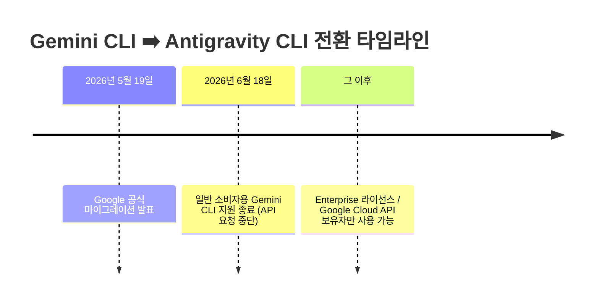

# 🛸 Gemini CLI 사용자 필독: 3분 만에 끝내는 Antigravity CLI 마이그레이션 완벽 가이드

> **"2026년 6월 18일, 기존 Gemini CLI 지원 종료!"**
> 아직도 `gemini cli`에 머물러 계신가요? Google의 차세대 AI 코딩 인터페이스인 **Antigravity CLI**로 쉽고 빠르게 넘어가실 수 있도록 가장 친절한 튜토리얼을 준비했습니다. 복잡한 공식 문서 대신 이 글 하나만 따라오세요!

---

## 📢 왜 지금 당장 마이그레이션해야 할까요?

Google의 AI 코딩 에이전트 생태계가 **Antigravity**를 중심으로 일원화됩니다. 이에 따라 기존 Gemini CLI에는 큰 변화가 생겼습니다.



> [!WARNING]
> **2026년 6월 18일** 이후에는 일반 무료 사용자들의 `gemini cli` 요청이 모두 차단됩니다. 개발 워크플로우가 끊기지 않도록 미리 마이그레이션을 완료해 두는 것이 좋습니다.

---

## ⚡ 한눈에 보는 환경설정 & 설치 경로 변화

마이그레이션 과정에서 가장 헷갈리는 부분은 **"기존 내 설정과 스킬들이 어디로 가느냐"**입니다. Antigravity 2.0으로 오면서 설정 경로가 깔끔하게 정돈되었습니다.

| 항목 | 기존: Gemini CLI 🔴 | 변경: Antigravity CLI 🟢 | 의미 |
| :--- | :--- | :--- | :--- |
| **전역 설정 디렉토리** | `~/.gemini/` | `~/.gemini/antigravity/` | 타 런타임과의 격리 강화 |
| **로컬 프로젝트 설정** | `gemini.json` | `.agent/` | 에이전트 자율 환경 구성 가능 |
| **확장 체계 명칭** | **Extensions** (확장 프로그램) | **Plugins** (플러그인) | 업계 표준 용어(Plugin)로 통일 |
| **하네스 연결** | 단독 프롬프팅 방식 | Shared Agent Harness | 데스크톱 앱과 설정 및 권한 공유 |

---

## 🛠️ 3단계 마이그레이션 실전 튜토리얼

공식 문서는 잊으셔도 좋습니다. 터미널을 열고 다음의 **3단계**만 그대로 실행해 주세요.

### 1단계: 기존 Gemini CLI 깔끔하게 언인스톨하기
기존 파일들과 꼬이지 않도록 이전에 쓰던 Gemini CLI를 전역 및 로컬에서 깨끗하게 지워줍니다. (GSD 메타 시스템 기준)

```bash
# 전역 설치되어 있던 gemini cli 제거
npx get-shit-done-cc --gemini --global --uninstall

# 혹시 로컬 프로젝트 단위로 설치했다면 local 제거
npx get-shit-done-cc --gemini --local --uninstall
```

### 2단계: 차세대 Antigravity CLI 설치하기
이제 새로운 `antigravity` 런타임을 설치합니다. 최신 버전을 설치하여 새로운 공유 하네스(Shared Harness)의 혜택을 누리세요.

```bash
# 전역(Global) 환경에 Antigravity CLI 설치
npx get-shit-done-cc@latest --antigravity --global

# (선택사항) 특정 프로젝트 단위로 로컬 설치하고 싶다면
npx get-shit-done-cc@latest --antigravity --local
```

### 3단계: 기존 확장 프로그램(Extensions) ➡️ 플러그인(Plugins) 이식하기
Antigravity CLI를 **처음 실행**하면 에이전트가 알아서 이전 Gemini CLI의 설정과 Extensions를 마이그레이션할지 묻습니다. 

만약 자동으로 진행되지 않았거나 수동으로 확실히 옮기고 싶다면, 터미널에 아래 명령어를 입력해 주세요.

```bash
# Gemini CLI의 기존 Extensions를 Antigravity Plugins로 이식
antigravity plugins migrate --from gemini
```

> [!NOTE]
> **알아두세요!** 
> 90% 이상의 Agent Skills, MCP 서버, 커스텀 훅 등 핵심 기능들은 1:1로 완벽하게 마이그레이션됩니다. 다만, 아주 극소수의 레거시 커스텀 테마 등 일부 시각적 요소는 호환되지 않을 수 있습니다.

---

## 🚀 Antigravity CLI의 강력한 새로운 기능들

이전을 완료하셨다면, Antigravity 2.0 환경에서만 누릴 수 있는 강력한 기능들을 확인해 보세요.

1. **Go 기반의 폭발적인 속도**: Rust/Go 기반 빌드로 코드베이스 분석 속도가 2배 이상 빨라졌습니다.
2. **비동기 백그라운드 태스크**: 터미널을 묶어두지 않고 멀티 에이전트 오케스트레이션을 백그라운드에서 실행할 수 있습니다.
3. **데스크톱 앱과의 완벽한 싱크**: `Antigravity 2.0 Desktop` 앱을 켜두면 CLI와 상태가 실시간 동기화되어 눈으로 직접 진행 과정을 보며 코딩할 수 있습니다.

---

### 💡 마이그레이션이 정상적으로 완료되었는지 확인하려면?
터미널에서 아래 명령어를 실행하여 새로운 헬프 가이드가 정상적으로 출력되는지 확인해 보세요!

```bash
# 새로운 Antigravity 시스템 프롬프트 및 명령어 로드 확인
/gsd-help
```

> **"지식은 공유될 때 더 크게 성장합니다."**
> 마이그레이션 과정에서 막히는 부분이 있거나 에러가 발생하면 언제든 댓글로 남겨주세요. 즐거운 AI 에이전트 코딩 되시길 바랍니다! 🛸
