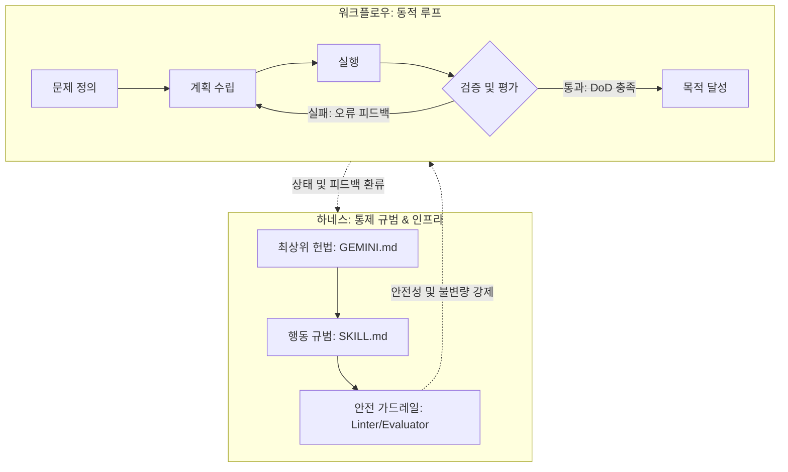
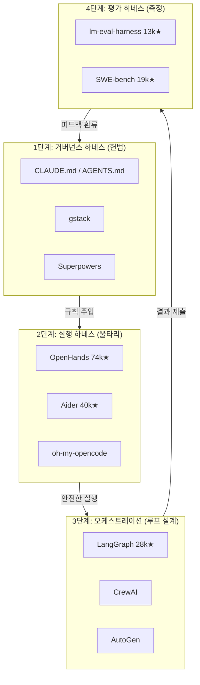

하네스 관련 지식들을 정리하고있는데 어느쪽이 더 맞는 설명인지 모르겠어

# A

```
지식 그래프(Graphify)와 위키 문서를 분석한 결과, 하네스(Harness)와 에이전트 워크플로우(Agentic Workflow)의 차이점은    
  다음과 같이 정리할 수 있습니다.

  1. 핵심 개념 차이

  ┌──────┬────────────────────────────────────────────┬─────────────────────────────────────────┐
  │ 구분 │ 하네스 (Harness)                           │ 에이전트 워크플로우 (Workflow)          │
  ├──────┼────────────────────────────────────────────┼─────────────────────────────────────────┤
  │ 비유 │ 모델(CPU)을 제어하는 운영체제(OS)          │ 목표를 달성하기 위한 업무 프로세스      │
  │ 정의 │ LLM의 능력을 제어하고 검증하는 인프라/환경 │ 에이전트가 수행하는 단계적 행동 순서    │
  │ 목적 │ 모델의 실수 방지 및 시스템적 안정성 확보   │ 특정 태스크(인제스트, 쿼리 등)의 완결성 │
  └──────┴────────────────────────────────────────────┴─────────────────────────────────────────┘
  ---

  2. 하네스 (Harness)
  하네스는 AI 모델이 안전하고 일관되게 동작하도록 감싸는 "가드레일과 도구의 총합"입니다.
   * 3계층 구조:
       1. 실행 하네스: 앱이 안전하게 구동되게 하는 구조 (Planner, Executor, Verifier 등).
       2. 개발 하네스: 개발 중 구조가 깨지지 않게 검사하는 장치 (Tests, CI).
       3. 작업 하네스: 에이전트가 일관되게 작업하도록 돕는 가이드 (GEMINI.md, SKILL.md).
   * 핵심 철학: "모델은 믿지 말고, 시스템(하네스)을 믿어라."

  3. 에이전트 워크플로우 (Workflow)
  워크플로우는 하네스라는 환경 안에서 에이전트가 실제로 "어떻게 움직이는가"에 대한 절차입니다.
   * 현재 시스템의 주요 워크플로우:
       * /ingest: raw 데이터를 읽고 wiki에 반영하는 과정.
       * /query: wiki를 탐색하여 답변을 생성하고 지식을 환류하는 과정.
       * /lint: wiki의 오류를 전수 검사하고 수정하는 과정.
   * 특징: Research -> Strategy -> Execution -> Validation으로 이어지는 반복적인 루프를 가집니다.

  ---

  💡 요약
  하네스는 에이전트가 뛰어노는 "운동장(규칙과 울타리)"이고, 워크플로우는 그 운동장에서 에이전트가 수행하는 "경기
  방식(전술과 순서)"입니다. 하네스가 튼튼할수록(안정성) 워크플로우는 더 복잡한 작업을 안정적으로 수행할 수 있게 됩니다.
```

# B

```
✦ graphify query 결과와 GEMINI.md 헌법을 종합하여 분석한 하네스(Harness)와 에이전트 워크플로우(Agent Workflow)의 핵심    
  차이점은 다음과 같습니다.

  결론부터 말씀드리면, 하네스는 "통치 규범(헌법)"이고, 워크플로우는 "실행 절차(SOP)"입니다.

  1. 하네스 (Harness / Constitution)
   * 성격: 시스템의 거버넌스 및 정책 레이어입니다.
   * 역할: 에이전트가 무엇을 할 수 있고, 무엇을 하면 안 되는지, 어떤 철학으로 지식을 관리해야 하는지를 규정하는 '헌법'   
     역할을 합니다.
   * 주요 구성 요소:
       * GEMINI.md (최상위 헌법): 시스템 정체성, 인간과 AI의 역할 분담, 절대 규칙.
       * CLAUDE.md / AGENTS.md: 에이전트의 페르소나와 준수 사항.
   * 비유: 국가로 치면 '헌법 및 법률'에 해당하며, 에이전트에게 지식의 '이식(Transplantation)'을 위한 토대를 제공합니다.  

  2. 에이전트 워크플로우 (Agent Workflow / Operations)
   * 성격: 시스템의 실행 및 운영 레이어입니다.
   * 역할: 하네스에 명시된 규칙을 준수하면서, 특정 목표(Task)를 달성하기 위해 밟아야 하는 구체적인 단계별 절차입니다.    
   * 주요 구성 요소:
       * Ingest: 소스 읽기 → 정보 추출 → 위키 통합 → 로그 기록.
       * Query: 지식 탐색 → 답변 생성 → 신규 위키 박제.
       * Lint: 모순 식별 → 정보 업데이트 → 고아 페이지 연결.
   * 비유: 국가로 치면 행정부의 '업무 매뉴얼'이나 'SOP'에 해당합니다.

  🔍 한눈에 비교

  ┌─────────────┬──────────────────────────────────────────┬──────────────────────────────────────────┐
  │ 구분        │ 하네스 (Harness)                         │ 워크플로우 (Workflow)                    │
  ├─────────────┼──────────────────────────────────────────┼──────────────────────────────────────────┤
  │ 핵심 질문   │ "우리는 누구이며, 어떤 규칙을 따르는가?" │ "이 일을 어떻게 순서대로 처리할 것인가?" │
  │ 수준(Level) │ 추상적, 전략적, 규범적                   │ 구체적, 전술적, 실행적                   │
  │ 파일 위치   │ GEMINI.md, .agent/rules/                 │ SKILL.md, .agent/workflows/              │
  │ 상태        │ 고정적 (안정적인 시스템 불변량)          │ 유동적 (작업 성격에 따라 최적화됨)       │
  └─────────────┴──────────────────────────────────────────┴──────────────────────────────────────────┘

  요약하자면: 하네스는 에이전트가 행동하는 '범위와 원칙'을 정해주고, 워크플로우는 그 안에서 에이전트가 움직이는 '동선과  
  순서'를 정의합니다.
```

---
두 설명 모두 틀리지 않지만, **맥락에 따라 강조점이 다릅니다.** 어느 쪽이 "더 맞다"기보다는 서로 다른 층위를 설명하고 있어요.

---

## 핵심 차이 분석

**A안** — "인프라/환경" 관점
- 하네스를 **구조적/기술적 계층** (실행·개발·작업 하네스)으로 분류
- OS 비유처럼 **런타임 안전성**에 초점
- "모델은 믿지 말고 시스템을 믿어라"는 철학이 핵심

**B안** — "거버넌스/정책" 관점
- 하네스를 **헌법·규범** 으로 정의
- GEMINI.md, CLAUDE.md 같은 **문서 파일 레이어**에 초점
- 헌법 vs SOP 비유가 명확하고 직관적

---

## 어느 쪽이 더 정확한가

**B안이 개념적으로 더 정확**합니다. 이유는:

1. **"하네스(Harness)"의 원래 의미**가 "제어·구속·규율"이라 거버넌스 프레임이 더 어원에 가깝습니다.
2. A안의 "3계층 구조"(실행/개발/작업 하네스)는 하네스를 너무 넓게 정의해서 **워크플로우와 경계가 흐릿**해집니다. SKILL.md를 "작업 하네스"로 분류하면, 워크플로우와 구분이 모호해지는 문제가 생겨요.
3. B안의 **"파일 위치"와 "고정적/유동적"** 구분은 실제 시스템 운영 시 명확한 기준이 됩니다.

---

## 통합 정리 제안

| 구분 | 하네스 | 워크플로우 |
|---|---|---|
| 비유 | 헌법 + OS 커널 | 업무 매뉴얼(SOP) |
| 질문 | "무엇을 허용/금지하는가?" | "어떤 순서로 실행하는가?" |
| 성격 | 고정적·규범적 | 유동적·실행적 |
| 예시 | GEMINI.md, CLAUDE.md | ingest, query, lint |

B안의 거버넌스 프레임을 기본으로 삼되, A안의 "모델을 믿지 말고 시스템을 믿어라"는 철학적 표현은 메모로 남겨두면 좋을 것 같습니다.

---

## 🎯 [대화 검증] 최종 진화: '목적 달성 루프'로서의 하네스 엔지니어링

사용자의 획기적인 통찰인 **"하네스 엔지니어링은 일종의 시스템을 통해 목적 달성까지 동작하게 하는 루프를 만드는 행위"**를 반영하여, A안(인프라)과 B안(거버넌스)을 유기적으로 통합합니다.

### 1. 왜 이 통찰이 완벽한가? (통합의 열쇠)
기존의 A안과 B안은 각각 '기술'과 '규범'이라는 서로 다른 단면만을 보고 있었습니다. 하지만 **'목적 달성을 위한 루프(Loop)'**라는 개념이 도입되면서 두 관점은 다음과 같이 하나로 묶입니다.

> **"하네스는 정적인 규범(헌법)이고, 워크플로우는 동적인 순서(SOP)이지만, 이 둘이 결합되어 최종 목적지에 도달할 때까지 멈추지 않고 스스로를 교정하며 작동하는 동적 시스템 전체가 바로 '하네스 엔지니어링(Harness Engineering)'이다."**

### 2. 루프의 3대 핵심 기둥
1. **상태 인지 루프 (Where am I?)**: AI가 현재 자신이 경로의 어디에 있는지 알게 하는 장치 (`GEMINI.md`, `PROJECT.md` 등 컨텍스트 제공).
2. **자가 복원 루프 (Self-Correction)**: 실패나 탈선 발생 시, 린터나 평가기(Evaluator)의 피드백을 받아 다시 시도하는 회복력.
3. **완결성 보장 루프 (DoD / UAT)**: 모델의 변동성을 제어하여, 사전에 정의된 인수 기준(DoD)을 만족할 때까지 동작을 강제하는 메커니즘.

### 3. 시각적 구조도


---

## 🌍 개념에서 실전으로: 하네스 엔지니어링 프로젝트 지형도

위에서 정리한 하네스(규범) + 워크플로우(루프) 개념이 실제 오픈소스 생태계에서 어떻게 구현되고 있는지를 프로젝트 단위로 매핑합니다. "이론은 알겠는데, 그래서 뭘 써?"에 대한 답입니다.

> 💡 **읽는 법**: 아래 표의 모든 프로젝트는 결국 같은 원리 — **"모델을 믿지 말고, 시스템(하네스)이 만드는 루프를 믿어라"** — 를 각자의 방식으로 구현하고 있습니다. 프로젝트별로 **어떤 하네스 기법**에 특화되어 있는지에 주목하면 개념이 체화됩니다.

### 1단계: 거버넌스 하네스 — "헌법을 만드는 프로젝트"

에이전트에게 정체성, 규칙, 행동 강령을 주입하는 **정적 규범 레이어**에 해당합니다.

| 프로젝트 | 규모 | 하네스 기법 | 설명 |
|---|---|---|---|
| **CLAUDE.md / AGENTS.md** (오픈 표준) | 업계 표준 | 컨텍스트 파일 주입 | Claude Code, Cursor, Copilot, Aider 등이 세션 시작 시 자동으로 읽는 **프로젝트 헌법** 파일. 우리 `GEMINI.md`도 이 계보입니다. |
| **gstack** (Garry Tan) | 커뮤니티 | 스킬 기반 가드레일 | Y Combinator 대표 Garry Tan이 공유한 AI 에이전트 스택. 에이전트에게 **역할별 스킬셋과 규칙**을 부여하는 하네스 설계 철학을 제시합니다. |
| **Superpowers** (Jesse Vincent) | 커뮤니티 | TDD 강제 + 설계 승인 | 코드 작성 전에 **테스트를 먼저 쓰게 강제(Red-Green-Refactor)**하고, 인간의 설계 승인 없이는 다음 단계로 못 넘어가게 막는 가드레일 프레임워크. |

### 2단계: 실행 하네스 — "울타리 안에서 뛰게 만드는 프로젝트"

에이전트가 실제로 동작할 때 **안전하게 격리하고, 실패 시 복원**하는 인프라 레이어입니다.

| 프로젝트 | ⭐ 규모 | 하네스 기법 | 설명 |
|---|---|---|---|
| **OpenHands** (구 OpenDevin) | ~74k★ | 샌드박스 격리 | 완전 자율 AI 소프트웨어 엔지니어. **Docker 컨테이너 안에서만** 셸·에디터·브라우저를 사용하게 하여, 호스트 시스템을 절대 오염시키지 못하게 가두는 **안전 울타리의 정석**. |
| **Aider** | ~40k★ | Git 자동 커밋 복원 | 터미널 기반 AI 페어 프로그래머. AI가 만든 모든 변경을 **즉시 Git 커밋**하여, 실패 시 `git revert`로 되돌리는 **자가 복원 루프**를 Git 인프라로 구현. |
| **oh-my-opencode** + Sisyphus | 커뮤니티 | 가상 팀 + 무한 루프 | OpenCode의 하네스 플러그인. **Sisyphus 오케스트레이터**가 Oracle(설계)·Librarian(문서) 등 전문 에이전트를 제어하고, **Todo Enforcer**로 작업 완료 시까지 루프를 유지. |

### 3단계: 오케스트레이션 하네스 — "루프 자체를 설계하는 프로젝트"

여러 에이전트의 **협업 순서, 상태 관리, 분기·재시도 로직**을 그래프나 역할 기반으로 제어하는 레이어입니다.

| 프로젝트 | ⭐ 규모 | 하네스 기법 | 설명 |
|---|---|---|---|
| **LangGraph** (LangChain) | ~28k★ | 상태 기반 그래프 | 에이전트의 실행 흐름을 **DAG(방향 비순환 그래프)**로 표현. 체크포인터로 상태를 저장하고, Human-in-the-Loop으로 인간 승인 게이트를 삽입하며, 노드 단위로 재시도를 제어하는 **프로덕션급 하네스의 교과서**. |
| **CrewAI** | 급성장 | 역할 기반 멀티 에이전트 | 에이전트에게 **페르소나(역할)와 목표를 헌법처럼 부여**하고, 그 안에서 협업 순서(워크플로우)를 정의. oh-my-opencode의 Oracle/Librarian 분할과 **같은 원리**의 범용 프레임워크. |
| **AutoGen (AG2)** (Microsoft) | 급성장 | 대화형 피드백 루프 | 에이전트끼리 **토론·반박하는 대화 자체**가 검증 하네스. "생성과 평가의 분리" 원칙이 에이전트 간 대화로 자연스럽게 구현됨. |

### 4단계: 평가 하네스 — "결과를 측정하는 프로젝트"

모델이나 에이전트의 **결과물을 객관적으로 검증**하여 "목적 달성 루프"의 **DoD(완료 기준)**를 제공하는 레이어입니다.

| 프로젝트 | ⭐ 규모 | 하네스 기법 | 설명 |
|---|---|---|---|
| **lm-evaluation-harness** (EleutherAI) | ~13k★ | 표준화된 벤치마크 | 이름 자체가 **"하네스"**. Hugging Face Open LLM Leaderboard의 엔진이며, 400+ 태스크로 모델 성능을 결정론적으로 측정. **"모델을 믿지 말고, 시스템(하네스)의 측정값을 믿어라"**의 정수. |
| **SWE-bench / SWE-agent** (Princeton) | ~19k★ | 실전 이슈 해결 벤치마크 | "에이전트가 실제 GitHub 이슈를 몇 개 해결하는가?"라는 **객관적 DoD**를 제공. 하네스의 "완결성 보장 루프"를 학술 벤치마크로 구현. |

---

### 🔗 전체 지형도 한눈에 보기



> **핵심**: 4개 레이어는 순차적 계층이 아니라, **순환하는 피드백 루프**입니다. 평가(L4)에서 나온 결과가 다시 거버넌스(L1)의 규칙을 개선하고, 그 규칙이 실행(L2)과 오케스트레이션(L3)을 더 정교하게 만듭니다. 이것이 바로 하네스 엔지니어링의 본질 — **목적 달성을 위한 시스템적 루프** — 입니다.