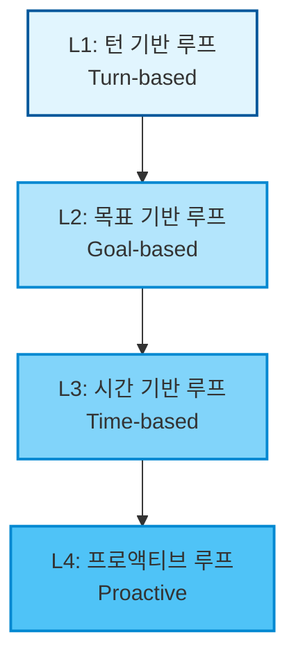

# 에이전트 루프 (Agentic Loop)

> 에이전트가 설정된 정지 조건(Exit Criteria)이 충족될 때까지 자율적으로 작업 사이클을 반복하여 수행하는 실행 메커니즘.

## 🧩 비유로 이해하기
* **자율주행 내비게이션**:
  * 단발성 프롬프트가 운전할 때 매 갈림길마다 동승자에게 "여기서 우회전하나요? 이제 직진하나요?" 하고 물어보며 멈추는 것이라면,
  * **에이전트 루프**는 목적지(Goal)만 찍어주면 경로를 이탈하더라도 내비게이션이 스스로 재탐색(Re-routing)을 거쳐 목적지에 도착할 때까지 자율적으로 계속 주행하는 것과 같습니다.

---

## 📋 정의
에이전트 루프는 AI 에이전트의 작동 방식이 단순한 **'질문-답변(Q&A) 턴'**에서 **'목적 중심의 자율 반복 실행'**으로 전환되는 핵심 메커니즘입니다. 
에이전트는 멈춤 조건이 충족되거나 최대 허용 횟수(Turn Cap)에 도달할 때까지 `컨텍스트 분석 -> 행동(도구 실행) -> 자기 검증(Self-Verification)` 과정을 자동으로 반복합니다.

---

## 🏗️ 에이전트 루프의 4단계 분류

Claude Code 팀의 분류 기준에 따르면, 루프는 사람의 개입 정도와 작동 방식에 따라 4가지 수준으로 나뉩니다.

### L1. 턴 기반 루프 (Turn-based Loop)
* **설명**: 프롬프트 한 번을 통해 발생하는 가장 단순한 형태의 루프입니다.
* **트리거**: 사용자의 수동 프롬프트 입력.
* **정지 기준**: 에이전트 스스로 작업을 완수했다고 판단하거나 추가 컨텍스트가 필요할 때.
* **강화 전략**: `SKILL.md`에 정량적 검증 가이드를 구체화하여 전달함으로써 에이전트의 자체 점검 능력을 높여 왕복 턴 수를 절감합니다.

### L2. 목표 기반 루프 (Goal-based Loop - `/goal`)
* **설명**: 한 번의 턴으로 끝내기 어려운 복잡한 목표를 해결하기 위해 사용됩니다.
* **트리거**: 실시간 명령 실행.
* **정지 기준**: 목표 완수(Evaluator 모델의 판단) 또는 최대 제한 횟수(Turn Cap) 도달.
* **적합한 사례**: "Lighthouse 성능 점수 90점 돌파", "테스트 코드 100% 통과" 등 명확하고 객관적으로 검증 가능한 목표 해결.

### L3. 시간 기반 루프 (Time-based Loop - `/loop`, `/schedule`)
* **설명**: 입력을 주기적으로 모니터링하거나 외부 환경에 대처해야 할 때 유용합니다.
* **트리거**: 정해진 시간 간격(Interval).
* **정지 기준**: 사용자의 수동 취소 또는 모니터링 대상 큐가 비는 등 작업 종결 조건 달성.
* **적합한 사례**: "1시간마다 Slack 피드백 채널 요약", "5분마다 GitHub PR 빌드 상태 확인 및 깨진 빌드 자동 수정".

### L4. 프로액티브 루프 (Proactive Loop)
* **설명**: 이벤트와 스케줄을 엮어 사람이 부재한 상황에서도 시스템이 자율적으로 업무를 처리하는 최고 단계의 자동화 루프입니다.
* **트리거**: 외부 이벤트(Webhook 등) 또는 스케줄링.
* **구성 프리미티브**: `/schedule` + `/goal` + `SKILL.md` + **동적 워크플로우(Dynamic Workflows)** + **오토 모드(Auto Mode)**의 통합.
* **적합한 사례**: 자율 버그 수정 파이프라인, 이슈 자동 트리아지 및 대응.

---

## 🛠️ 핵심 성공 요인 (품질 및 비용 관리)

1. **정량적 자가 검증 (Quantitative Self-Verification)**
   * 에이전트가 "됐다"고 자의적으로 타협하는 것을 방지하기 위해, 통과 기준은 정성적인 느낌이 아닌 **숫자, 통과한 테스트 개수, 에러 콘솔 로그 무결성** 등 명확한 눈금으로 측정 가능해야 합니다.
2. **에디터로서의 시니어 (Senior as Editor)**
   * 에이전트가 지저분한 코드 컨벤션을 모방하지 않도록 깔끔한 코드베이스 환경을 유지해야 하며, 최종 검수 단계에서는 사람이 '편집자'로서 리뷰를 수행하거나 세컨드 에이전트에게 교차 리뷰를 받도록 설계합니다.
3. **토큰 소모 방어 장치 (Cost Guardrails)**
   * 에이전트가 무한 루프에 빠져 API 비용이 폭증하는 것을 막기 위해 `Turn Cap`(예: 최대 5회 시도)을 선언하고, 규칙적인 변환 작업 등은 프롬프트가 아닌 로컬 스크립트를 작성하여 에이전트가 이를 호출하게 만듭니다.

---

## 🔗 연결된 지식
* [[agentic-workflow]] (에이전트 워크플로우) - 에이전트 루프가 '반복성과 트리거'에 집중한다면, 워크플로우는 '실행 단계와 프로세스'에 집중합니다.
* [[harness-engineering]] (하네스 엔지니어링) - 에이전트 루프가 안전한 궤도를 이탈하지 않도록 울타리를 쳐주는 거버넌스 및 제약 시스템입니다.
* [[claude-code]] (Claude Code) - 본 개념을 상용 프리미티브로 분류하고 표준화한 CLI 엔진입니다.
