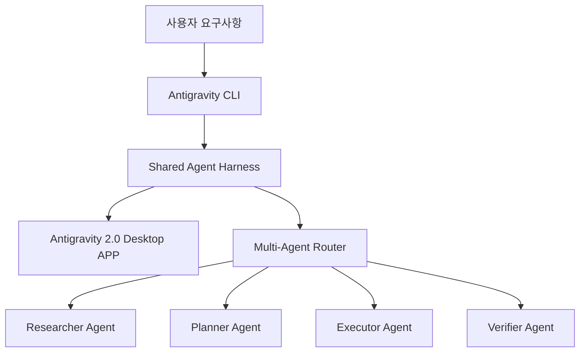

# 🛸 Antigravity CLI

> **"터미널 속의 지식 대리인, 바이브 코딩에서 엔지니어링으로의 전환"**
> 기존 Google Gemini CLI를 계승하여 더욱 강력한 에이전트 하네스(Shared Agent Harness) 체계와 멀티 에이전트 오케스트레이션을 제공하는 차세대 AI 개발 인터페이스입니다. 공식 명령어는 `agy`를 사용합니다.

---

## 🛠️ 주요 아키텍처 및 특징

1. **Shared Agent Harness (공유 에이전트 하네스)**
   - Antigravity 2.0 데스크톱 앱과 CLI가 설정을 공유하는 통합 엔진입니다. 한쪽에서 정의한 권한, 에이전트 프로필, API 키 등이 실시간으로 연동되어 동일한 컨텍스트 내에서 동작합니다.
2. **Go 기반의 고성능 비동기 아키텍처**
   - 기존의 Node.js/Python 기반의 CLI에 비해 대규모 코드베이스 파싱 속도가 압도적으로 빨라졌으며, 터미널 세션을 잠그지 않고 비동기적으로 무거운 작업을 백그라운드에서 실행할 수 있습니다.
3. **확장성 및 플러그인(Plugins) 체계**
   - 과거 Gemini CLI에서 제공하던 확장 프로그램(Extensions)이 업계 표준인 **Plugins**로 재정의되었습니다.
   - `agy plugin import gemini` 명령을 통해 기존 환경을 손쉽게 마이그레이션할 수 있습니다.
   - MCP(Model Context Protocol) 서버 및 커스텀 에이전트 스킬([[superpowers]]) 등을 자유롭게 주입하고 공유할 수 있습니다.

4. **네이티브 슬래시 명령어 및 단축키**
   - **/usage**: 터미널 내에서 대화형 도움말 매뉴얼을 엽니다.
   - **/agents**: 실행 중인 서브에이전트의 상태를 확인하고 관리하는 TUI를 엽니다.
   - **/logout**: 세션을 종료하고 캐시된 인증 정보를 삭제합니다.
   - **ctrl+k**: 서브에이전트의 권한 요청(Fast Path Approval)을 즉시 승인합니다.

---

## 🔄 Gemini CLI 와의 매핑 정보

| 기능 영역 | Gemini CLI | Antigravity CLI | 비고 |
| :--- | :--- | :--- | :--- |
| **핵심 명령어** | `gemini` | `agy` | `antigravity`는 별칭이 아니므로 주의 |
| **코어 엔진** | Single-Agent Prompting | Shared Agent Harness | 멀티 에이전트 지원 |
| **확장 체계** | Extensions (확장 프로그램) | Plugins (플러그인) | `agy plugin import` 지원 |
| **로컬 설정 디렉토리** | `~/.gemini/` | `~/.gemini/antigravity-cli/` | 설정 공유 및 격리 |
| **로컬 프로젝트 설정** | `gemini.json` | `.agents/` | 더 정교한 상태 관리 지원 |

---

## 🔗 연결된 지식
- [[harness-engineering]] : 에이전트가 완결성 있게 동작하도록 규정하는 컨텍스트 레이어
- [[agentic-workflow]] : 자율적인 계획-실행-검증의 사이클
- [[gsd2]] : Antigravity 환경을 적극 활용하는 Get Shit Done V2 프레임워크
