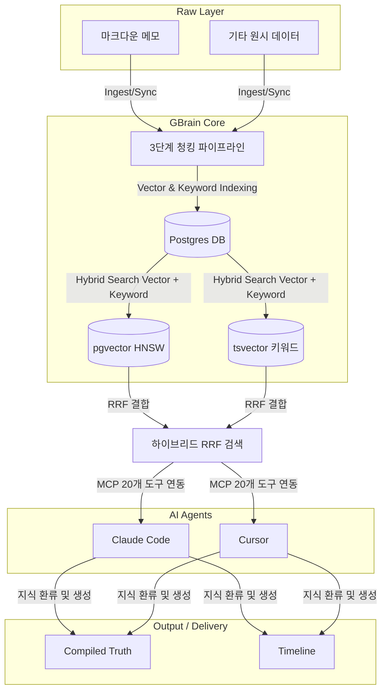

# GBrain — 오픈소스 개인 지식 베이스

> [!NOTE]
> YC CEO Garry Tan이 Andrej Karpathy의 LLMWiki 아키텍처에서 영감을 받아 구현한 Postgres 기반 개인 지식 관리(PKM) 및 AI 에이전트 협업 도구.

---

## 1. 개요 및 요약
**GBrain**은 흩어진 마크다운 메모와 원시 데이터를 Postgres 기반의 단일 구조화된 지식 엔진으로 통합하는 시스템입니다. 단순한 검색을 넘어 **AI 에이전트(Claude Code, Cursor 등)가 사용자의 지식을 마치 하나의 거대한 '맥락 메모리(Knowledge Brain)'처럼 실시간으로 쿼리하고 건강성을 검사하며 데이터를 확장할 수 있도록** 설계되었습니다.

---

## 2. 핵심 내용 요약

### A. 지식 모델: 정리된 진실 (Compiled Truth) vs 역사 (Timeline)
GBrain은 기존 메모 작성 방식의 누적 오염 문제를 해결하기 위해 두 가지 레이어를 엄격하게 분리합니다.
1. **정리된 진실 (Compiled Truth)**: 특정 주제에 대한 현재 시점의 '최선이자 유일한 이해(Executable SSOT)'를 가리킵니다. 새로운 증거나 소스가 인입되면 덮어쓰기(overwrite) 방식으로 전면 재작성하여 중복과 모순을 원천 차단합니다.
2. **역사 (Timeline)**: 정보가 습득된 타임라인과 개별 근거(증거)들을 단순 추가(append-only) 형태로 보존합니다.

### B. 하이엔드 하이브리드 검색 아키텍처
단순 키워드 매칭이나 벡터 임베딩 단독 검색의 단점을 보완하기 위해 고성능 RAG(검색 증강 생성) 기법을 탑재했습니다.
- **RRF (Reciprocal Rank Fusion)**: 벡터(pgvector HNSW)와 키워드(tsvector) 검색 결과의 순위를 결합하여 최적의 연관 결과를 도출합니다.
- **Multi-Query Expansion**: 사용자의 원본 질문을 Claude Haiku를 사용하여 2개의 다른 표현으로 자동 확장함으로써 검색 성공률을 극대화합니다.
- **3단계 청킹 전략**: 속도가 빠른 Recursive 청킹, 의미 경계를 추론하는 Semantic 청킹, 그리고 AI가 문맥을 유지하며 쪼개는 LLM-guided(Claude Haiku 활용) 청킹을 유연하게 선택할 수 있습니다.

### C. 에이전트 전용 스킬 및 MCP 탑재
GBrain은 사람이 읽는 노션(Notion)에 그치지 않고, AI가 20개의 MCP(Model Context Protocol) 툴을 통해 데이터를 제어할 수 있도록 **7가지 에이전트 스킬**을 내장하고 있습니다.
- `ingest`: 기사와 미팅록을 파싱하여 정리된 진실을 재작성하고 교차 링크를 생성합니다.
- `query`: 하이브리드 검색을 통해 답변을 합성하고 출처를 명확히 인용하며, 근거가 없을 시 할루시네이션(환각)을 방지하기 위해 "정보 없음"을 명시합니다.
- `maintain`: 지식 베이스 내의 모순, 오래된 내용, 고아 페이지, 깨진 링크 등을 감지하는 셀프 헬스 체크 스킬입니다.
- `enrich`: 외부 API와 연동해 최신 데이터를 가져와 지식을 보강합니다.
- `briefing`: 일정과 마케팅/딜 데드라인을 취합해 매일 아침 맞춤형 컨텍스트 요약을 제공합니다.
- `migrate` / `install`: Obsidian, Notion, Logseq 등 다양한 마크다운 저장소의 쉬운 마이그레이션 및 자동 원클릭 설치(`clawhub`)를 지원합니다.

---

## 3. 연결된 지식 (Connected Knowledge)
- **개념**: [[compiled-truth]] (정리된 진실의 지식 모델), [[hybrid-search]] (의미 기반 하이브리드 검색), [[agentic-workflow]] (에이전트 스킬)
- **엔티티**: [[gbrain]] (개인 지식 베이스 도구), [[garry-tan]] (개발자), [[claude-code]] (연동 에이전트), [[gstack]] (AI 엔지니어링 스택)

---

## 4. 나의 생각 및 메모 (My Rationale & Vision Connection)
> **"나의 지식과 사고방식을 그대로 투영하는 AI 지식 대리인(Proxy)의 완벽한 백엔드 철학"**

이 소스에서 소개된 GBrain의 아키텍처는 제가 정의한 [나의 핵심맥락](../나의 핵심맥락.md)에 고스란히 닿아 있습니다.
1. **'기억의 부채' 해결**: 흩어진 마크다운을 Postgres RRF 하이브리드 검색과 MCP로 묶어 AI 에이전트의 영구적인 기억 장치로 변환합니다.
2. **'디지털 자아(지식 대리인)'의 토대**: `compiled truth`를 구축해 지식을 복리(`[[knowledge-compounding]]`)로 증식시키고, 타인이나 AI가 내 지식에 질문했을 때 일관되고 오류 없는 답변(`query` 스킬)을 제공할 수 있도록 만듭니다.
3. **운영의 지혜**: `maintain` 스킬을 통해 AI 스스로 지식의 결함을 수정하도록 유도하는 것은 우리가 `[[wiki-architecture]]`와 `/lint` 명령어로 추구하는 방향과 완벽하게 정렬(Align)됩니다. 향후 나의 AI 대리인 시스템을 설계할 때 이 Postgres + RRF + MCP 설계를 기술 표준으로 벤치마킹해야겠습니다.
