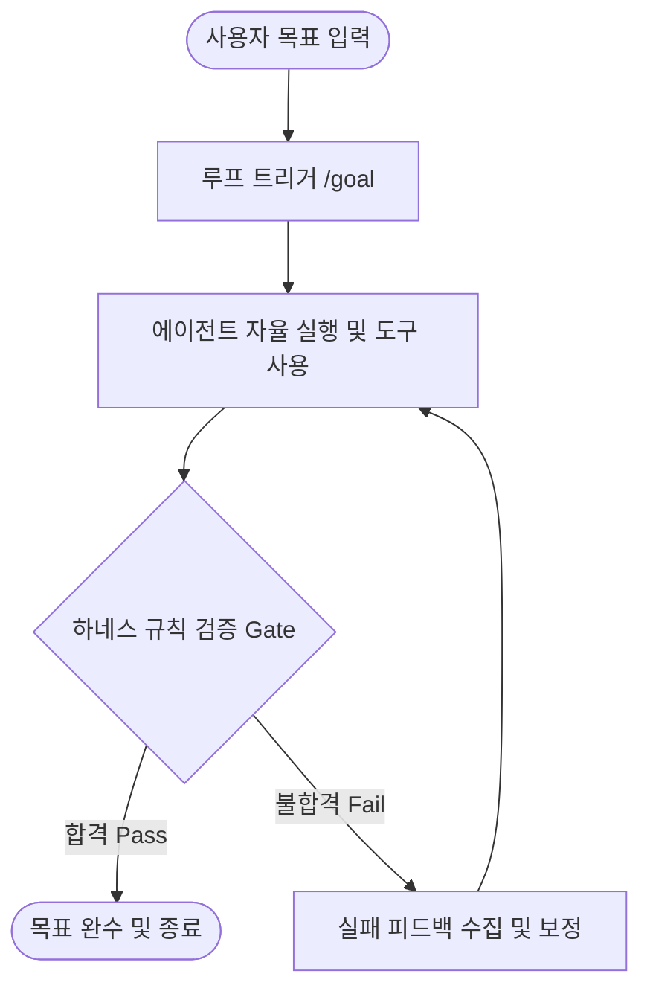

# 에이전트 루프와 하네스 엔지니어링 비교 분석 문서 작성 구현 계획 (Implementation Plan)

> **For Claude:** REQUIRED SUB-SKILL: Use superpowers:executing-plans to implement this plan task-by-task.

**Goal:** LLM Wiki의 '비교/분석(Comparisons)' 섹션에 에이전트 루프와 하네스 엔지니어링의 아키텍처적 관계를 명확히 대조하는 비교 문서(`loop-vs-harness.md`)를 작성하고 색인을 업데이트합니다.

**Architecture:** 하네스(정적 거버넌스)와 루프(동적 오퍼레이션)의 역할 분담을 설명하는 Comparison Matrix를 포함하고, 두 메커니즘의 상호작용 주기를 Mermaid 다이어그램으로 시각화하여 유기적으로 통합합니다.

**Tech Stack:** Markdown, Obsidian wiki-link, Mermaid

---

### Task 1: 비교 분석 문서 생성 (`content/wiki/comparisons/loop-vs-harness.md`)

**Files:**
- Create: `content/wiki/comparisons/loop-vs-harness.md`

**Step 1: 문서 작성 전 검증 (Pre-checks)**
대상이 되는 concepts 파일인 `content/wiki/concepts/agentic-loop.md` 및 `content/wiki/concepts/harness-engineering.md`가 정상적으로 존재하고 읽을 수 있는지 확인합니다.

실행: (Windows pwsh 기준)
```powershell
Test-Path content/wiki/concepts/agentic-loop.md
Test-Path content/wiki/concepts/harness-engineering.md
```
Expected: `True` 출력

**Step 2: 마크다운 컨텐츠 작성**
아래의 뼈대와 컨텐츠로 `content/wiki/comparisons/loop-vs-harness.md` 파일을 생성합니다.

```markdown
---
title: "에이전트 루프와 하네스 엔지니어링 (Loop vs Harness)"
type: comparison
tags: [agent, methodology, harness-engineering, agentic-loop]
sources: [content/raw/articles/Getting started with loops.md, content/raw/notes/Harness_Engineering.md]
created: 2026-07-08
updated: 2026-07-08
draft: false
---

# 에이전트 루프와 하네스 엔지니어링 (Loop vs Harness)

> **엔진(Loop)과 가드레일(Harness)의 조화**: 자율적으로 목표를 반복하여 추구하는 능력과, 그 반복 과정이 안전하게 제어되고 검증되도록 울타리를 쳐주는 통제 프레임워크의 아키텍처적 대비.

---

## 🧩 비유로 이해하는 아키텍처 관계
* **에이전트 루프 (동적 엔진 / Loop)**: 
  * 목적지(Goal)를 향해 스스로 가속, 감속, 조향을 수행하며 전진하는 **자율주행 차량**입니다. 목적지에 도착할 때까지 자율적으로 주행 제어를 반복합니다.
* **하네스 엔지니어링 (정적 가드레일 / Harness)**:
  * 차량이 도로 밖으로 튕겨 나가거나 추돌하는 것을 막기 위해 명문화된 **안전 가드레일, 신호등, 도로 차선**입니다. 차량의 성능을 제한하는 목적이 아니라, 차량이 안전 궤도를 벗어났을 때 복구 가능하게 강제하는 규칙(Rule)입니다.

---

## 📊 아키텍처 수평 대조 (Comparison Matrix)

| 구분 | [[agentic-loop\|에이전트 루프 (Agentic Loop)]] | [[harness-engineering\|하네스 엔지니어링 (Harness Engineering)]] |
|---|---|---|
| **역할 정의** | 목표 달성을 위해 작업을 반복 수행하는 **동적 실행 엔진** | 에이전트의 안정성과 논리적 무결성을 통제하는 **정적 가드레일** |
| **제어 수준** | 오퍼레이션 / 프로세스 (Operations) | 거버넌스 / 불변성 규범 (Governance) |
| **주요 메커니즘** | 자가 평가(Evaluation), 상태 전이, 스케줄링, 동적 하위 위임 | 환경 격리(Sandbox), 규칙 명문화(GEMINI.md), 사후 자동 검증 |
| **물리적 실체** | `/goal`, `/loop`, `/schedule` 등 에이전트 구동 프리미티브 | `GEMINI.md`, `CLAUDE.md`, 자동화 린트 스크립트 |
| **핵심 목적** | 사람이 개입하지 않는 자율적 도달과 생산성 극대화 | 에이전트 폭주(무한 루프, 비용 폭발) 차단 및 지식 왜곡 방지 |

---

## 🏗️ 상호작용 메커니즘 (Interactivity Flow)

에이전트 루프가 회전할 때, 하네스는 매 루프의 관문(Gate)으로 작동하며 에이전트의 행동을 검증합니다.



1. **트리거**: 사용자가 `/goal`과 함께 완료 정의를 선언하면 에이전트 루프가 시작됩니다.
2. **자율 행동**: 에이전트는 계획에 맞추어 코드를 편집하거나 지식을 합성하는 루틴을 반복합니다.
3. **하네스 게이트**: 루프 완료 전, 하네스(린터, 테스트 자동화, `GEMINI.md` 체크리스트)가 가동되어 산출물의 무결성을 강제 검증합니다.
4. **회류 또는 종결**: 검증이 실패하면 실패 피드백을 에이전트 컨텍스트에 주입해 다음 루프 턴에서 고치게 만들고, 통과할 때만 루프를 탈출시킵니다.

---

## 🔗 연결된 지식
* [[agentic-loop]] (에이전트 루프) - 오퍼레이션 엔진 상세
* [[harness-engineering]] (하네스 엔지니어링) - 거버넌스 제약 상세
* [[agentic-workflow]] (에이전트 워크플로우) - 정립된 작업 단계 절차

---

## 💡 지식 공유를 위한 적용 포인트
지식 공유 세션이나 스레드를 구성할 때 **"에이전트의 성능 향상(Loop)"**만 다루기보다는, **"이를 안전하게 통제할 수 있는 하네스(Harness)"**를 함께 설계해야 비로소 상용화 수준의 에이전트 운용이 가능하다는 점을 강조하기 위한 핵심 개념으로 본 문서를 활용할 수 있습니다.
```

**Step 3: 파일 포맷 및 링크 유효성 검사**
마크다운 포맷에 깨진 기호나 링크가 없는지 뷰어로 자체 체크합니다.

**Step 4: 변경 사항 커밋**
실행:
```bash
git add content/wiki/comparisons/loop-vs-harness.md
git commit -m "docs: create comparison page for agentic-loop vs harness-engineering"
```

---

### Task 2: Wiki Portal Index 업데이트 (`content/wiki/index.md`)

**Files:**
- Modify: `content/wiki/index.md`

**Step 1: 비교 섹션 및 통계 업데이트**
* `### 🔗 비교/분석 (Comparisons)` 항목 하단에 `- [[loop-vs-harness]] (에이전트 루프와 하네스 엔지니어링의 관계 분석)`을 추가합니다.
* **통계** 섹션의 총 페이지 수를 `65`에서 `66`으로 갱신하고, 마지막 업데이트 날짜를 `2026-07-08`로 업데이트합니다.

**Step 2: 수동 확인 (Grep)**
수정 사항이 인덱스에 잘 들어갔는지 확인합니다.
실행:
```bash
git diff content/wiki/index.md
```
Expected: `[[loop-vs-harness]]` 추가 내역 및 통계 변경 확인

**Step 3: 변경 사항 커밋**
실행:
```bash
git add content/wiki/index.md
git commit -m "docs: register loop-vs-harness in index and update page count to 66"
```

---

### Task 3: 위키 작업 이력 로그 작성 (`content/wiki/log.md`)

**Files:**
- Modify: `content/wiki/log.md`

**Step 1: 로그 항목 기록**
최상단 2026-07-08 ingest 엔트리 위에 다음과 같은 신규 비교 문항 기록을 삽입합니다.

```markdown
## [2026-07-08] comparison | 에이전트 루프와 하네스 엔지니어링의 관계 분석
- **작업 내용**:
    - [[loop-vs-harness]] : 에이전트 루프(Loop)와 하네스 엔지니어링(Harness)의 수평적 매핑 및 상호작용 흐름도를 시각화한 비교 분석 문서 작성.
- **업데이트된 페이지**:
    - [[index.md]] (System) : 비교/분석 목록 추가 및 통계(총 페이지 66개) 갱신.
- **잔여 문제**: 없음.

---
```

**Step 2: 최종 무결성 검사**
파일 린트 및 오류가 없는지 `git diff`를 통해 확인합니다.

**Step 3: 변경 사항 커밋**
실행:
```bash
git add content/wiki/log.md
git commit -m "docs: log loop-vs-harness comparison page creation in wiki log"
```
