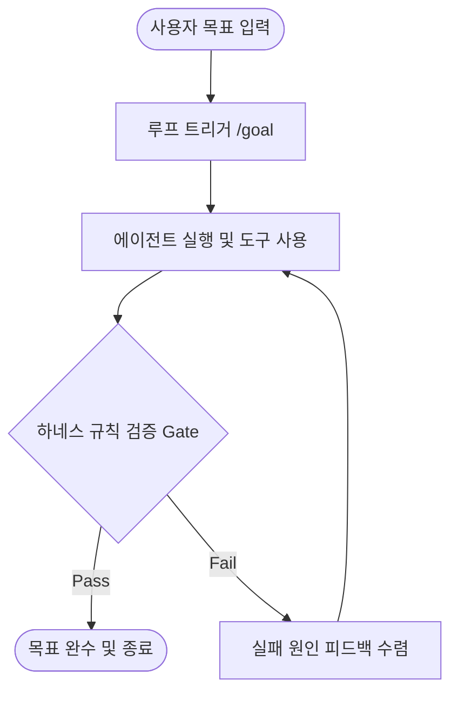

# Spec: 에이전트 루프와 하네스 엔지니어링 비교 분석 문서 작성

- **작성일**: 2026-07-08
- **주제**: 에이전트 루프 (Agentic Loop)와 하네스 엔지니어링 (Harness Engineering)의 아키텍처적 비교 대조
- **목적**: LLM Wiki의 '비교/분석(Comparisons)' 카테고리에 유기적으로 결합된 개념 문서를 추가하여 AI 지식 공유의 깊이를 더함.

---

## 1. 요구사항 및 목표
* **고유 도메인 보존**: 두 개념을 강제로 종속시키지 않고 수평적인 평행 관계로 매핑.
* **비유 중심 설명**: 독자가 직관적으로 이해할 수 있는 차량과 도로 인프라 비유 사용.
* **Mermaid 시각화**: 실행과 검증 가이드가 어떻게 유기적으로 순환하는지 다이어그램으로 명시.

---

## 2. 상세 설계 및 구성안

### 2.1 문서 메타데이터 (Frontmatter)
* 생성 경로: `content/wiki/comparisons/loop-vs-harness.md`
* 메타데이터 필드:
  ```yaml
  title: "에이전트 루프와 하네스 엔지니어링 (Loop vs Harness)"
  type: comparison
  tags: [agent, methodology, harness-engineering, agentic-loop]
  sources: [content/raw/articles/Getting started with loops.md, content/raw/notes/Harness_Engineering.md]
  created: 2026-07-08
  updated: 2026-07-08
  draft: false
  ```

### 2.2 도입부: 비유 대조군 (Metaphor Matrix)
* **에이전트 루프**: 자율주행 차량 (목적지에 닿을 때까지 가속, 제동, 조향을 반복하며 나아감)
* **하네스 엔지니어링**: 차선, 신호등, 도로 규격, 에어백 (차량이 도로 밖으로 튕겨나가 파손되는 것을 방지하는 물리적/규범적 한계 장치)

### 2.3 아키텍처 수평 대조표 (Comparison Matrix)
* 역할 분담, 통제 수준, 주체, 구성 단위, 주요 명령어 및 설정 파일의 비교를 명확한 마크다운 테이블로 기술.

### 2.4 상호작용 메커니즘 (Mermaid Flowchart)
에이전트가 `/goal` 등으로 루프를 돌면서 하네스 가드(예: `GEMINI.md`, `validation scripts`)를 거쳐 나아가는 라이프사이클을 가시화:


### 2.5 시스템 파일 반영
* `content/wiki/index.md` 내에 `[[loop-vs-harness]] (에이전트 루프와 하네스 엔지니어링의 관계 분석)` 추가.
* `content/wiki/index.md` 통계 업데이트 (총 페이지 수: 65 ➔ 66, 마지막 업데이트 메시지 갱신).
* `content/wiki/log.md`에 본 비교 분석 작업 로그 작성.

---

## 3. 예외 및 주의사항
* 위키링크 (`[[link]]`) 검증을 사전에 거쳐 깨진 링크가 발생하지 않도록 조치.
* 기존 `[[agentic-loop]]`와 `[[harness-engineering]]` 문서의 링크 무결성 검증.
